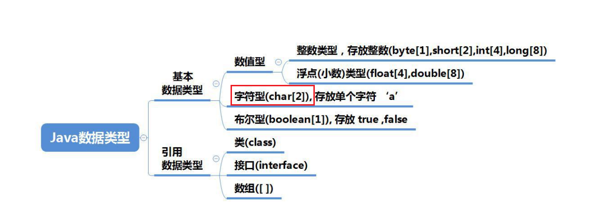
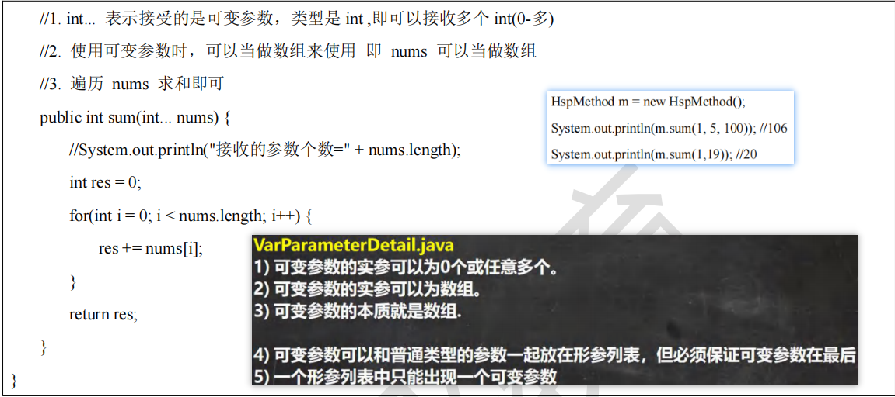
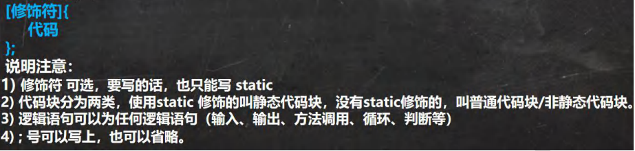

# Java必背知识点

## java初级基础

程序：计算机执行某些操作或解决某个问题而编写的一系列**有序指令的集合**

---


### Java 重要特点

1) Java 语言是**面向对象的(oop)**
2) Java 语言是**健壮的**。Java 的强类型机制、异常处理、垃圾的自动收集等是 Java 程序健壮性的重要保证
3) Java 语言是**跨平台性的**。[即: 一个编译好的.class 文件可以在多个系统下运行，这种特性称为跨平台]

4) Java 语言是**解释型**的

**解释性语言**：javascript,PHP, java 

**编译性语言**: c / c++

区别是：解释性语言，编译后的代码，不能直接被机器执行,需要解释器来执行, 编译性语言, 编译后的代码, 可

以直接被机器执行, c /c++

---


### 什么是 JDK，JRE

#### JDK 基本介绍

1) JDK 的全称(Java Development Kit Java 开发工具包)

​	**JDK = JRE + java 的开发工具 [java, javac,javadoc,javap 等]**

2) JDK 是提供给 Java 开发人员使用的，其中包含了 java 的开发工具，也包括了 JRE。所以安装了 JDK，就不用在单独

安装 JRE 了。


#### JRE 基本介绍

1) JRE(Java Runtime Environment Java 运行环境) 

	**JRE = JVM + Java 的核心类库[类]**

2) 包括 Java 虚拟机(JVM Java Virtual Machine)和 Java 程序所需的核心类库等，如果想要运行一个开发好的 Java 程序，

计算机中只需要安装 JRE 即可。


#### JDK、JRE 和 JVM 的包含关系

1) **JDK = JRE +** **开发工具集**（例如 Javac,java 编译工具等)
2) **JRE = JVM + Java SE** **标准类库**（java 核心类库）
3) 如果只想运行开发好的 .class 文件 只需要 JRE

---


### 数据类型



java的整数常量**默认为int**，声明long型后面要‘l’或者‘L’

java浮点数=符号位+指数位+尾数位 尾数部分可能丢失，造成精度损失(小数都是近似值)

java浮点型常量**默认为double**，声明float后面要加‘f’或者‘F’

#### 基本数据类型转换

##### 自动类型转换


##### 强制类型转换

自动类型转换的逆过程，**将容量大的数据类型转换为容量小的数据类型**。使用时要加上强制转换符 ( )，但可能造成

**精度降低或溢出**,格外要注意。

在将 String 类型转成 基本数据类型时， 要确保String类型能转换为有效的数据，比如 我们可以把 "123" , 转成一个整数，但是不能把 "hello" 转成一个整数

---


### 进制

对于整数，有四种表示方式：

二进制：0,1 ，满 2 进 1.**以 0b 或 0B 开头**。

十进制：0-9 ，满 10 进 1。

八进制：0-7 ，满 8 进 1. **以数字 0 开头表示**。

十六进制：0-9 及 A(10)-F(15)，满 16 进 1. 以 **0x** **或** **0X** 开头表示。此处的 A-F 不区分大小写。

---


### 数组

**动态初始化** int[] a;a=new int[10];

**静态初始化** int[] a = {1,2,3}

1.数组中的元素可以是任何数据类型，包括基本类型和引用类型，但是不能混用。

2.数组的**下标是从** **0** **开始的**。

3.数组创建后，如果没有赋值，有默认值

int 0，short 0, byte 0, long 0, float 0.0,double 0.0，char \u0000，boolean false，String null

---


### 类和对象的区别和联系


---


### 方法重载(OverLoad)

java 中允许同一个类中，多个同名方法的存在，但要求 形参列表不一致！


---


### 可变参数



---


### 构造器


---


### 对象创建的流程分析


---


### this关键字

java虚拟机会给每个对象分配一个this，代表当前对象

1) this 关键字可以用来访问本类的属性、方法、构造器
2) this 用于区分当前类的属性和局部变量
3) 访问成员方法的语法：this.方法名(参数列表);

4) 访问构造器语法：this(参数列表); 注意只能在构造器中使用(即只能在构造器中访问另外一个构造器, 必须放在第一

条语句)

5) this 不能在类定义的外部使用，只能在类定义的方法中使用

---


### 访问修饰符

java 提供四种访问控制修饰符号，用于控制方法和属性(成员变量)的访问权限（范围）


只有默认和public能修饰类！

---


### 面向对象编程三大特征

面向对象编程有三大特征：封装、继承和多态。

#### 封装


**封装的实现步骤 (三步)**


#### 继承


继承语法 class 子类 **extends** 父类{}

子类继承了所有的属性和方法，非私有的属性和方法可以在子类直接访问, 但是私有属性和方法不能在子类直接访

问，要通过父类提供公共的方法去访问

2) **子类必须调用父类的构造器， 完成父类的初始化**
3) 当创建子类对象时，不管使用子类的哪个构造器，默认情况下总会去调用父类的无参构造器，如果父类没有提供无

参构造器，则必须在子类的构造器中用 super 去指定使用父类的哪个构造器完成对父类的初始化工作，否则，编译不会通过(怎么理解。) 

4) 如果希望指定去调用父类的某个构造器，则显式的调用一下 : super(参数列表)
5) super 在使用时，必须放在构造器第一行(super 只能在构造器中使用)
6) **super() 和 this() 都只能放在构造器第一行，因此这两个方法不能共存在一个构造器**
7) java 所有类都是 Object 类的子类, Object 是所有类的基类. 
8) 父类构造器的调用不限于直接父类！将一直往上追溯直到 Object 类(顶级父类)
9) 子类最多只能继承一个父类(指直接继承)，即 java 中是单继承机制。

思考：如何让 A 类继承 B 类和 C 类？ 【A 继承 B， B 继承 C】

10) 不能滥用继承，子类和父类之间必须满足 is-a 的逻辑关系

##### 方法的重写

不想要父类的方法的实现


**重载和重写的比较**


#### 多态

方法或对象具有多种形态。是面向对象的第三大特征，多态是建立在封装和继承基础之上的。

对象的多态 **(核心，困难，重点)**


**多态注意事项和细节讨论**

多态的**前提是**：两个对象(类)存在继承关系

多态的向上转型


多态向下转型


属性没有重写之说！属性的值看编译类型

##### instanceOf 比较操作符

用于判断对象的运行类型是否为 XX 类型或 XX 类型的子类型

```java
public class PolyDetail03 {
    public static void main(String[] args) {
        BB bb = new BB();
        System.out.println(bb instanceof BB);// true
        System.out.println(bb instanceof AA);// true
//aa 编译类型 AA, 运行类型是 BB
//BB 是 AA 子类
        AA aa = new BB();
        System.out.println(aa instanceof AA);
        System.out.println(aa instanceof BB);
        Object obj = new Object();
        System.out.println(obj instanceof AA);//false
        String str = "hello";
//System.out.println(str instanceof AA);
        System.out.println(str instanceof Object);//true
    }
}
class AA {
} //父类
class BB extends AA {
}//子类
```

##### java 的动态绑定机制(非常非常重要.)


如果将子类的的sum方法注释掉，将会调用父类的sum 但是 geil会调用子类的 


##### 多态的应用

1) 多态数组

	数组的定义类型为父类类型，里面保存的实际元素类型为子类类型

	```java
	/*应用实例:现有一个继承结构如下：要求创建 1 个 Person 对象、2 个 Student 对象和 2 个 Teacher 对象, 统一放在数组
	中，并调用每个对象say 方法*/
	Person[] persons = new Person[5];
	persons[0] = new Person("jack", 20);
	persons[1] = new Student("mary", 18, 100);
	persons[2] = new Student("smith", 19, 30.1);
	persons[3] = new Teacher("scott", 30, 20000);
	persons[4] = new Teacher("king", 50, 25000);
	//循环遍历多态数组，调用 say
	for (int i = 0; i < persons.length; i++) {
	//person[i] 编译类型是 Person ,运行类型是是根据实际情况有 JVM 来判断
	System.out.println(persons[i].say());//动态绑定机制
	//这里大家聪明. 使用 类型判断 + 向下转型. 
	if(persons[i] instanceof Student) {//判断 person[i] 的运行类型是不是 Student
		Student student = (Student)persons[i];//向下转型
		student.study();
	//小伙伴也可以使用一条语句 ((Student)persons[i]).study();
	} else if(persons[i] instanceof Teacher) {
	Teacher teacher = (Teacher)persons[i];
	teacher.teach();
	    } else if(persons[i] instanceof Person){
	//System.out.println("你的类型有误, 请自己检查...");
	} else {
	System.out.println("你的类型有误, 请自己检查...");
	}
	}
	}
	```

	2.多态参数

	方法定义的形参为父类类型，实参允许为子类类型

	```java
	public void test(Person a){
		a.work()
	}//test(b)b为Person的子类即可
	```

	面对一些调用子类特有的要求
	可以用if (instanceof)
	来判断以后向下转型后调用

	

---


### super 关键字

super 代表父类的引用，用于**访问父类的属性、方法、构造**器


---


### Object类详解

#### equals 方法

==和 equals 的对比


```java
//看看 Object 类的 equals 是
//即 Object 的 equals 方法默认就是比较对象地址是否相同
//也就是判断两个对象是不是同一个对象. 
public boolean equals(Object obj) {
    return (this == obj);
}
//带大家看看 Jdk 的源码 String 类的 equals 方法
//把 Object 的 equals 方法重写了,变成了比较两个字符串值是否相同
public boolean equals(Object anObject) {
    if (this == anObject) {//如果是同一个对象
        return true;//返回 true
    }
    if (anObject instanceof String) {//判断类型
        String anotherString = (String) anObject;//向下转型
        int n = value.length;
        if (n == anotherString.value.length) {//如果长度相同
            char v1[] = value;
            char v2[] = anotherString.value;
            int i = 0;
            while (n-- != 0) {//然后一个一个的比较字符
                if (v1[i] != v2[i])
                    return false;
                i++;
            }
            return true;//如果两个字符串的所有字符都相等，则返回 true
        }
    }
    return false;//如果比较的不是字符串，则直接返回 false
}
```

#### hashCode 方法

返回该对象的哈希码值。由Object类定义的hashCode方法会针对不同对象返回不同的整数（一般是通过将该对象的内部地址转换为一个整数实现的）

1) 提高具有哈希结构的容器的效率！
2) 两个引用，如果指向的是同一个对象，则哈希值肯定是一样的！
3) 两个引用，如果指向的是不同对象，则哈希值是不一样的
4) 哈希值主要根据地址号来的！， **不能完全将哈希值等价于地址**。

#### toString 方法

默认返回：全类名+@+哈希值的十六进制，【查看 Object 的 toString 方法】

1.子类往往重写 toString 方法，用于返回对象的属性信息

2.重写 toString 方法，打印对象或拼接对象时，都会自动调用该对象的 toString 形式.

3.**当直接输出一个对象时，toString 方法会被默认的调用**, 比如 System.out.println(monster)； 就会默认调用

monster.toString()

```java
/*
Object 的 toString() 源码
public String toString() {
return getClass().getName() + "@" + Integer.toHexString(hashCode());
}
*/
```

#### finalize 方法

1) 当对象被回收时，系统自动调用该对象的 finalize 方法。子类可以重写该方法，做一些释放资源的操作
2) 什么时候被回收：当某个对象没有任何引用时，则 jvm 就认为这个对象是一个垃圾对象，就会使用垃圾回收机制来

销毁该对象，在销毁该对象前，会先调用 finalize 方法。

3) 垃圾回收机制的调用，是由系统来决定(即有自己的 GC 算法), 也可以通过 System.gc() 主动触发垃圾回收机制，测

试

我们在实际开发中，几乎不会运用 finalize , 所以更多就是为了应付面试.


## 高级部分

### 静态变量（static）

静态变量也叫类变量/静态属性，是该类的所有对象共享的变量,任何一个该类的对象去访问它时,取到的都是相同的值,同样任何一个该类的对象去修改它时,修改的也是同一个变量。

#### 静态变量使用注意事项和细节讨论

1. 当我们需要让某个类的所有对象都共享一个变量时，就可以考虑使用静态变量:比如:定义学生类，统计所有学生共交多少钱。

2. 静态变量与实例变量(普通属性)区别

​	静态变量是该类的所有对象共享的，而实例变量是每个对象独享的。

3. 加上static称为静态变量，否则称为实例变量/普通变量/非静态变量

4. 静态变量可以通过 类名,类变量名 或者 对象名,类变量名 来访问，但java设计者推荐我们使用 类名.静态变量名方式访问。【前提是 满足访问修饰符的访问权限和范围】

5. 实例变量不能通过 类名.静态变量名 方式访问.

6. 静态变量是在类加载时就初始化了，也就是说，即使你没有创建对象，只要类加载了就可以使用静态变量了。

---


### 静态方法

 静态方法的使用和静态变量类似

1. 当方法中不涉及到任何和对象相关的成员，则可以将方法设计成静态方法,提高开发效率。

	> 比如:工具类中的方法 utils包中的Math类、Arrays类、Collections 集合类
	>
	> 如 Math类中random方法 直接Math.random()就能返回一个0~1的数 不用实例化Math对象就能使用

2. 在程序员实际开发，往往会将一些通用的方法，设计成静态方法，这样我们不需要创建对象就可以使用了，比如打印一维数组， 冒泡排序,完成某个计算任务 等
3.  静态方法方法和普通方法都是随着类的加载而加载，将结构信息存储在方法区:
4.  静态方法方法中无this的参数普通方法中隐含着this的参数
5.  静态方法方法可以通过类名调用，也可以通过对象名调用。
6. 普通方法和对象有关，需要通过对象名调用，比如对象名.方法名(参数)，不能通过类名调用。
7.  静态方法方法中不允许使用和对象有关的关键字，比如this和super。普通方法(成员方法)可以。
8. 静态方法中 只能访问 静态变量 或静态方法。

> 小结: 静态方法只能访问静态的成员, 非静态的方法，可以访问静态成员和非静态成员（必须遵守访问权限)

### 理解 main 方法语法


1) 在 main()方法中，我们可以直接调用 main 方法所在类的静态方法或静态属性。
2) 但是，不能直接访问该类中的非静态成员，必须创建该类的一个实例对象后，才能通过这个对象去访问类中的非静

态成员

3) 代码

```java
public class Main01 {
    private static String name = "韩顺平教育";
    private int n1 = 10000;
    public static void hi() {
        System.out.println("Main01 的 hi 方法");
    }
    public void cry() {
        System.out.println("Main01 的 cry 方法");
    }

    public static void main(String[] args) {
	//可以直接使用 name
	//1. 静态方法 main 可以访问本类的静态成员
        System.out.println("name=" + name);
        hi();
	//2. 静态方法 main 不可以访问本类的非静态成员
	//System.out.println("n1=" + n1);//错误
	//cry();
	//3. 静态方法 main 要访问本类的非静态成员，需要先创建对象 , 再调用即可
        Main01 main01 = new Main01();
        System.out.println(main01.n1);//ok
        main01.cry();
    }
}
```

### 代码块

代码化块又称为初始化块,是类的一部分，类似于方法，将逻辑语句封装在方法体中，通过{}包围起来。

但和方法不同，没有方法名没有返回，没有参数，只有方法体，而且不用通过对象或类显式调用，而是加载类时，或创建对象时隐式调用。




#### **代码块使用注意事项和细节讨论**


### 单例设计模式

#### 什么是单例模式


#### 饿汉式

```java
public class SingleTon01 {
    public static void main(String[] args) {
	//通过方法可以获取对象
     	GirlFriend instance = GirlFriend.getInstance();
    }
}
//只能有一个女朋友
class GirlFriend {
    private String name;
//为了能够在静态方法中，返回 gf 对象，需要将其修饰为 static
	private static GirlFriend gf = new GirlFriend("小红红");
    private GirlFriend(String name) {
        System.out.println("構造器被調用.");
        this.name = name;
    }
    public static GirlFriend getInstance() {
        return gf;
    }

```

> //如何保障我们只能创建一个 GirlFriend 对象
> //步骤[单例模式-饿汉式]
> //1. 将构造器私有化
> //2. 在类的内部直接创建对象(该对象是 static)
> //3. 提供一个公共的 static 方法，返回 gf 对象
>
> //餓漢式可能造成創建了對象，但是沒有使用. 因为静态属性会类加载而加载 如果该类有个public static 的属性 被外使用就会类加载

#### 懒汉式

```java
public class SingleTon02 {
    public static void main(String[] args) {
        Cat instance = Cat.getInstance();
    }
}
//希望在程序運行過程中，只能創建一個 Cat 對象
class Cat {
    private String name;
    public static int n1 = 999;
    private static Cat cat; //默認是 null
    private Cat(String name) {
        System.out.println("構造器調用...");
        this.name = name;
    }
    public static Cat getInstance() {
        if (cat == null) {//如果還沒有創建 cat 對象
            cat = new Cat("小可愛");
        }
        return cat;
    }
}
```

> //步驟
>
> //1.仍然構造器私有化
> //2.定義一個 static 靜態屬性對象
> //3.提供一個 public 的 static 方法，可以返回一個 Cat 對象
> //4.懶漢式，只有當用戶使用 getInstance 時，才返回 cat 對象, 後面再次調用時，會返回上次創建的 cat 對象
>
> 有线程安全问题

#### 饿汉式 VS 懒汉式


### final 关键字


#### final 使用注意事项和细节讨论


