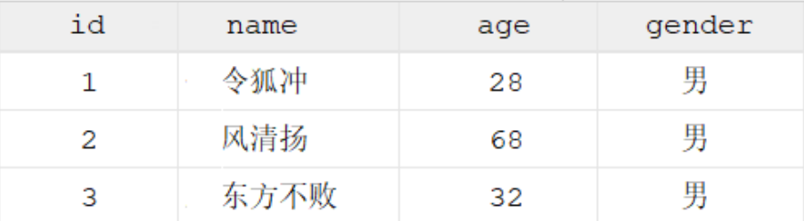

# MySQL数据库学习

## 一、基础篇

### 1.数据库相关概念

| **名称**       | **全称**                                                     | **简称**                          |
| :------------- | ------------------------------------------------------------ | --------------------------------- |
| 数据库         | 存储数据的仓库，数据是有组织的进行存储                       | DataBase（DB）                    |
| 数据库管理系统 | 操纵和管理数据库的大型软件                                   | DataBase Management System (DBMS) |
| SQL            | 操作关系型数据库的编程语言，定义了一套操作关系型数据库统一标准 | Structured Query Language (SQL)   |

### 2.数据库的三大范式

**第一范式(1NF)：**是指数据库表的每一列都是不可分割的基本数据线；也就是说：每列的值具有原子性，不可再分割。

**第二范式(2NF)：**是在第一范式(1NF)的基础上建立起来得，满足第二范式(2NF)必须先满足第一范式(1NF)。如果表是单主键，那么主键以外的列必须完全依赖于主键；如果表是复合主键，那么主键以外的列必须完全依赖于主键，不能仅依赖主键的一部分。

**第三范式(3NF)：**是在第二范式的基础上建立起来的，即满足第三范式必须要先满足第二范式。第三范式(3NF)要求：表中的非主键列必须和主键直接相关而不能间接相关；也就是说：非主键列之间不能相关依赖。

### 3.SQL分类

| **分类**                                     | **说明**                   | 举例                     |
| -------------------------------------------- | -------------------------- | ------------------------ |
| DDL(Data Definition Language) 数据定义语言   | 用来操作数据库、表、列等   | CREATE、 ALTER、DROP     |
| DML(Data Manipulation Language) 数据操作语言 | 用来操作数据库中表里的数据 | INSERT、 UPDATE、 DELETE |
| DQL(Data Query Language) 数据查询语言        | 用来查询数据               | SELECT                   |
| DCL(Data Control Language) 数据控制语言      | 用来操作访问权限和安全级别 | GRANT、DENY              |

### 4.DDL数据定义语言

#### 4.1 数据库的基本操作

* **查询所有数据库**  `show databases ;`
* **查询当前数据库 **`select database() ;`
*  **创建数据库** `create database [ if not exists ] 数据库名 [ default charset 字符集 ] [ collate 排序规则 ] ;`
*  **删除数据库** `drop database [ if exists ] 数据库名 ; `
* **切换数据库** `use 数据库名 ;`

#### 4.2 数据表的基本操作

* **查询当前数据库所有表** `show tables;`

*  **查看指定表结构** `desc 表名 ; `

* **查询指定表的建表语句** `show create table 表名 ;`

* **创建表结构**

	 ```mysql
	 CREATE TABLE 表名(
	     字段1 字段1类型 [ COMMENT 字段1注释 ],
	     字段2 字段2类型 [COMMENT 字段2注释 ],
	     字段3 字段3类型 [COMMENT 字段3注释 ],
	     ......
	     字段n 字段n类型 [COMMENT 字段n注释 ]
	 ) [ COMMENT 表注释 ] ;
	```

> 注意: [...] 内为可选参数，最后一个字段后面没有逗号

比如，我们创建一张表 tb_user ，对应的结构如下，那么建表语句为：



```mysql
create table tb_user(
    id int comment '编号',
    name varchar(50) comment '姓名',
    age int comment '年龄',
    gender varchar(1) comment '性别'
) comment '用户表';
```


##### 4.2.1 数据库的数据类型

###### 4.2.1.1 数值类型

| 类型         | 大小   | 有符号(SIGNED)范围                                    | 无符号(UNSIGNED)范围                                       | 描述               |
| ------------ | ------ | ----------------------------------------------------- | ---------------------------------------------------------- | ------------------ |
| TINYINT      | 1 byte | (-128，127)                                           | (0，255)                                                   | 小整数值           |
| SMALLINT     | 2bytes | (-32768，32767)                                       | (0，65535)                                                 | 大整数值           |
| MEDIUMINT    | 3bytes | (-8388608，8388607)                                   | (0，16777215)                                              | 大整数值           |
| INT或INTEGER | 4bytes | (-2147483648，2147483647)                             | (0，4294967295)                                            | 大整数值           |
| BIGINT       | 8bytes | (-2^63，2^63-1)                                       | (0，2^64-1)                                                | 极大整值           |
| FLOAT        | 4bytes | (-3.402823466 E+38，3.402823466351  E+38)             | 0 和 (1.175494351  E-38，3.402823466 E+38)                 | 单精度浮点数值     |
| DOUBLE       | 8bytes | (-1.7976931348623157 E+308，1.7976931348623157 E+308) | 0 和  (2.2250738585072014 E-308，1.7976931348623157 E+308) | 双精度浮点数值     |
| DECIMAL      |        | 依赖于M(精度)和D(标度)的值                            | 依赖于M(精度)和D(标度)的值                                 | 小数值(精确定点数) |

举例：

>1). 年龄字段 -- 不会出现负数, 而且人的年龄不会太大 ------>age tinyint unsigned
>
>2). 分数 -- 总分100分, 最多出现一位小数------> score double(4,1)


###### 4.2.1.2 字符串类型

| 类型       | 大小                  | 描述                         |
| ---------- | --------------------- | ---------------------------- |
| CHAR       | 0-255 bytes           | 定长字符串                   |
| VARCHAR    | 0-65535 bytes         | 变长字符串                   |
| TINYBLOB   | 0-255 bytes           | 不超过255个字符的二进制数据  |
| TINYTEXT   | 0-255 bytes           | 短文本字符串                 |
| BLOB       | 0-65 535 bytes        | 二进制形式的长文本数据       |
| TEXT       | 0-65 535 bytes        | 长文本数据                   |
| MEDIUMBLOB | 0-16 777 215 bytes    | 二进制形式的中等长度文本数据 |
| MEDIUMTEXT | 0-16 777 215 bytes    | 中等长度文本数据             |
| LONGBLOB   | 0-4 294 967 295 bytes | 二进制形式的极大文本数据     |
| LONGTEXT   | 0-4 294 967 295 bytes | 极大文本数据                 |

> char 与 varchar 都可以描述字符串，char是定长字符串，指定长度多长，就占用多少个字符，和字段值的长度无关 。而varchar是变长字符串，指定的长度为最大占用长度 。相对来说，char的性能会更高些。

举例：

>1). 用户名 username ------> 长度不定, 最长不会超过50------> username varchar(50)
>
>2). 性别 gender ---------> 存储值, 不是男,就是女------>gender char(1)
>
>3). 手机号 phone --------> 固定长度为11------> phone char(11)

###### 4.2.1.3 日期类型

| 类型      | 大小 | 范围                                       | 格式                | 描述                     |
| --------- | ---- | ------------------------------------------ | ------------------- | ------------------------ |
| DATE      | 3    | 1000-01-01 至  9999-12-31                  | YYYY-MM-DD          | 日期值                   |
| TIME      | 3    | -838:59:59 至  838:59:59                   | HH:MM:SS            | 时间值或持续时间         |
| YEAR      | 1    | 1901 至 2155                               | YYYY                | 年份值                   |
| DATETIME  | 8    | 1000-01-01 00:00:00 至 9999-12-31 23:59:59 | YYYY-MM-DD HH:MM:SS | 混合日期和时间值         |
| TIMESTAMP | 4    | 1970-01-01 00:00:01 至 2038-01-19 03:14:07 | YYYY-MM-DD HH:MM:SS | 混合日期和时间值，时间戳 |

举例：

>1). 生日字段 birthday------> birthday date
>
>2). 创建时间 createtime ------>createtime datetime

###### 数据类型案例

```mysql
/*
设计一张员工信息表，要求如下：
1. 编号（纯数字）
2. 员工工号 (字符串类型，长度不超过10位)
3. 员工姓名（字符串类型，长度不超过10位）
4. 性别（男/女，存储一个汉字）
5. 年龄（正常人年龄，不可能存储负数）
6. 身份证号（二代身份证号均为18位，身份证中有X这样的字符）
7. 入职时间（取值年月日即可）
*/
create table employee(
id int comment '编号',
workno varchar(10) comment '工号',
name varchar(10) comment '姓名',
gender char(1) comment '性别',
age tinyint unsigned comment '年龄',
idcard char(18) comment '身份证号',
entrydate date comment '入职时间'
) comment '员工表';
```

##### 4.2.2 数据表的修改

* **添加字段** `ALTER TABLE 表名 ADD 字段名 类型 (长度) [ COMMENT 注释 ] [ 约束 ]; `

* **修改数据类型** `ALTER TABLE 表名 MODIFY 字段名 新数据类型 (长度); `

* **修改字段名和字段类型** `ALTER TABLE 表名 CHANGE 旧字段名 新字段名 类型 (长度) [ COMMENT 注释 ] [ 约束 ];`

* **删除字段** `ALTER TABLE 表名 DROP 字段名; `

* **修改表名** `ALTER TABLE 表名 RENAME TO 新表名; `

```mysql
#案例:为emp表增加一个新的字段”昵称”为nickname，类型为varchar(20)

ALTER TABLE employee ADD nickname varchar(20) COMMENT '昵称'; 

#案例:将emp表的nickname字段修改为username，类型为varchar(30)

ALTER TABLE employee CHANGE nickname username varchar(30) COMMENT '昵称';

#案例: 将emp表的字段username删除

ALTER TABLE employee DROP username; 

#案例: 将emp表的表名修改为 employee

ALTER TABLE employee RENAME TO employee;  
```


##### 4.2.3 数据表的删除

* **删除表** `DROP TABLE [ IF EXISTS ] 表名; `

* **删除指定表, 并重新创建表** `TRUNCATE TABLE 表名; `

```mysql
#案例:如果tb_user表存在，则删除tb_user表

DROP TABLE IF EXISTS tb_user; 
```


### 5.DML数据操作语言

* 添加数据（INSERT）
* 修改数据（UPDATE）
* 删除数据（DELETE）

#### 5.1 添加数据

*  **给指定字段添加数据** `INSERT INTO 表名 (字段名1, 字段名2, ...) VALUES (值1, 值2, ...); `
*  **给全部字段添加数据 **`INSERT INTO 表名 VALUES (值1, 值2, ...); `
*  **批量添加数据** `INSERT INTO 表名 (字段名1, 字段名2, ...) VALUES (值1, 值2, ...), (值1, 值2, ...), (值1, 值2, ...);`或者`INSERT INTO 表名 VALUES (值1, 值2, ...), (值1, 值2, ...), (值1, 值2, ...) ; `

```mysql
#案例: 给employee表所有的字段添加数据 ；

insert into employee(id,workno,name,gender,age,idcard,entrydate)
values (1,'1','Itcast','男',10,'123456789012345678','2000-01-01');

#案例：插入数据到employee表

insert into employee values(2,'2','张无忌','男',18,'123456789012345670','2005-01-01');

#案例：批量插入数据到employee表

insert into employee values(3,'3','韦一笑','男',38,'123456789012345670','2005-01-

01'),(4,'4','赵敏','女',18,'123456789012345670','2005-01-01');
```

> 注意事项:
>
> • 插入数据时，指定的字段顺序需要与值的顺序是一一对应的。
>
> • 字符串和日期型数据应该包含在引号中。
>
> • 插入的数据大小，应该在字段的规定范围内。

#### 5.2 数据修改

修改数据的具体语法为:

`UPDATE 表名 SET 字段名1 = 值1 , 字段名2 = 值2 , .... [ WHERE 条件 ] ; `

```mysql
#案例:

#A. 修改id为1的数据，将name修改为itheima
update employee set name = 'itheima' where id = 1;

#B. 修改id为1的数据, 将name修改为小昭, gender修改为 女
update employee set name = '小昭' , gender = '女' where id = 1;

#C. 将所有的员工入职日期修改为 2008-01-01
update employee set entrydate = '2008-01-01';
```

>注意事项:
>
>修改语句的条件可以有，也可以没有，如果没有条件，则会修改整张表的所有数据。

#### 5.3 删除数据

删除数据的具体语法为：

`DELETE FROM 表名 [ WHERE 条件 ] ; `

```mysql
#案例:

#A. 删除gender为女的员工
delete from employee where gender = '女';

#B. 删除所有员工
delete from employee;
```

>注意事项:
>
>• DELETE 语句的条件可以有，也可以没有，如果没有条件，则会删除整张表的所有数据。
>
>• DELETE 语句不能删除某一个字段的值(可以使用UPDATE，将该字段值置为NULL即可)。
>
>• 当进行删除全部数据操作时，datagrip会提示我们，询问是否确认删除，我们直接点击Execute即可


### 6.DQL数据查询语言

查询关键字: SELECT

完成如下数据准备工作:

```mysql
create table emp(
id int comment '编号',
workno varchar(10) comment '工号',
name varchar(10) comment '姓名',
gender char(1) comment '性别',
age tinyint unsigned comment '年龄',
idcard char(18) comment '身份证号',
workaddress varchar(50) comment '工作地址',
entrydate date comment '入职时间'
)comment '员工表';

INSERT INTO emp VALUES 
(1, '00001', '小红', '女', 20, '123456789012345678', '北京', '2000-01-01'),
(2, '00002', '张无忌', '男', 18, '123456789012345670', '北京', '2005-09-01'),
(3, '00003', '韦一笑', '男', 38, '123456789712345670', '上海', '2005-08-01'),
(4, '00004', '赵敏', '女', 18, '123456757123845670', '北京', '2009-12-01'),
(5, '00005', '小昭', '女', 16, '123456769012345678', '上海', '2007-07-01'),
(6, '00006', '杨逍', '男', 28, '12345678931234567X', '北京', '2006-01-01'),
(7, '00007', '范瑶', '男', 40, '123456789212345670', '北京', '2005-05-01'),
(8, '00008', '黛绮丝', '女', 38, '123456157123645670', '天津', '2015-05-01'),
(9, '00009', '小黄', '女', 45, '123156789012345678', '北京', '2010-04-01'),
(10, '00010', '陈友谅', '男', 53, '123456789012345670', '上海', '2011-01-01'),
(11, '00011', '张士诚', '男', 55, '123567897123465670', '江苏', '2015-05-01'), 
(12, '00012', '常遇春', '男', 32, '123446757152345670', '北京', '2004-02-01'),
(13, '00013', '张三丰', '男', 88, '123656789012345678', '江苏', '2020-11-01'),
(14, '00014', '灭绝', '女', 65, '123456719012345670', '西安', '2019-05-01'),
(15, '00015', '胡青牛', '男', 70, '12345674971234567X', '西安', '2018-04-01'),
(16, '00016', '周芷若', '女', 18, null, '北京', '2012-06-01');
```

准备完毕后，我们就可以看到emp表中准备的16条数据。接下来，我们来完成DQL语法的学习。

#### 6.1 基本语法

```mysql
SELECT
字段列表
FROM
表名列表
WHERE
条件列表
GROUP BY
分组字段列表
HAVING
分组后条件列表
ORDER BY
排序字段列表
LIMIT
分页参数
```

#### 6.2 普通查询

* **查询多个字段** 

	`SELECT 字段1, 字段2, 字段3 ... FROM 表名 ;`

	`SELECT * FROM 表名 ; `

> 注意 : * 号代表查询所有字段，在实际开发中尽量少用（不直观、影响效率）。

* **字段设置别名**

`SELECT 字段1 [ AS 别名1 ] , 字段2 [ AS 别名2 ] ... FROM 表名;`

`SELECT 字段1 [ 别名1 ] , 字段2 [ 别名2 ] ... FROM 表名; `

* **去除重复记录**

`SELECT DISTINCT 字段列表 FROM 表名; `

```mysql
# 案例：
# A. 查询指定字段 name, workno, age并返回
select name,workno,age from emp;

# B. 查询返回所有字段
select id ,workno,name,gender,age,idcard,workaddress,entrydate from emp; 
select * from emp;

C. 查询所有员工的工作地址,起别名
select workaddress as '工作地址' from emp; 
# -- as可以省略
select workaddress '工作地址' from emp;

# D. 查询公司员工的上班地址有哪些(不要重复)
select distinct workaddress '工作地址' from emp;
```

#### 6.3 条件查询

**语法**：

`SELECT 字段列表 FROM 表名 WHERE 条件列表 ; `

##### 6.3.1 使用关系运算符查询

| 关系运算符 | 说明     |
| ---------- | -------- |
| =          | 等于     |
| <>         | 不等于   |
| !=         | 不等于   |
| <          | 小于     |
| <=         | 小于等于 |
| >          | 大于     |
| >=         | 大于等于 |


| **逻辑运算符** | **功能**                    |
| -------------- | --------------------------- |
| AND 或 &&      | 并且 (多个条件同时成立)     |
| OR 或 \|\|     | 或者 (多个条件任意一个成立) |
| NOT 或 !       | 非 , 不是                   |

##### 6.3.2 使用IN关键字查询

IN关键字用于判断某个字段的值是否在指定集合中。如果字段的值恰好在指定的集合中，则将字段所在的记录将査询出来。

##### 6.3.3 使用BETWEEN AND关键字查询

BETWEEN AND用于判断某个字段的值是否在指定的范围之内。如果字段的值在指定范围内，则将所在的记录将查询出来

##### 6.3.4 使用空值查询

在MySQL中，使用 IS NULL关键字判断字段的值是否为空值。请注意：空值NULL不同于0，也不同于空字符串

##### 6.3.5使用LIKE关键字查询

MySQL中可使用LIKE关键字可以判断两个字符串是否相匹配 模糊匹配(_匹配单个字符, %匹配任意个字符)

```mysql
#案例：
#1.查询年龄等于88的员工
select * from emp where age = 88;

#2.查询年龄小于20的员工信息
select * from emp where age < 20;

#3.查询年龄小于等于20的员工信息
select * from emp where age <= 20;

#4.查询没有身份证号的员工信息
select * from emp where idcard is null;

#5.查询有身份证号的员工信息
select * from emp where idcard is not null;

#6.查询年龄不等于88的员工信息
select * from emp where age != 88;
select * from emp where age <> 88;

#7.查询年龄在15岁(包含) 到 20岁(包含)之间的员工信息
select * from emp where age between 15 and 20;

#8.查询性别为 女 且年龄小于 25岁的员工信息
select * from emp where gender = '女' && age < 25;

#9.查询年龄等于18 或 20 或 40 的员工信息
select * from emp where age = 18 || age = 20 || age = 40;
select * from emp where age in(18,20,40);

#10.查询姓名为两个字的员工信息 _ %
select * from emp where name like '__';

#11.查询身份证号最后一位是X的员工信息
select * from emp where idcard like '%X';
select * from emp where idcard like '_________________X';
```

#### 6.4 聚合函数

**说明**：将一列数据作为一个整体，进行纵向计算

| 语法  | select 聚合函数（字段列表）from 表名; |
| ----- | ------------------------------------- |
| count | 统计数量                              |
| max   | 最大值                                |
| min   | 最小值                                |
| avg   | 平均值                                |
| sum   | 求和                                  |

**语法**：`SELECT 聚合函数(字段列表) FROM 表名 ;`

> 注意 : NULL值是不参与所有聚合函数运算的。

```mysql
#案例
#A 统计该企业的员工数量
select count(*) from emp; -- 统计的是总记录数
select count(idcard) from emp; 的计算结果是15 -- 统计的是idcard字段不为null的记录数

#B 统计该企业员工的平均年龄
select avg(age) from emp;

#C 统计该企业员工的最大年龄
select max(age) from emp;

#D 统计该企业员工的最大年龄
select max(age) from emp;

#E 统计该企业员工的最小年龄
select min(age) from emp;

# 统计西安地区员工的年龄之和
select sum(age) from emp where workaddress = '西安';
```

#### 6.5 分组查询

**说明：**GROUP BY 子句可像切蛋糕一样将表中的数据进行分组，再进行查询等操作。换言之，可通俗地理解为：通过GROUP BY将原来的表拆分成了几张小表。

**语法**:`SELECT 字段列表 FROM 表名 [ WHERE 条件 ] GROUP BY 分组字段名 [ HAVING 分组后过滤条件 ];`

**where与having区别**

* 执行时机不同：where是分组之前进行过滤，不满足where条件，不参与分组；而having是分组之后对结果进行过滤。

* 判断条件不同：where不能对聚合函数进行判断，而having可以。

>注意事项:
>
>• 分组之后，查询的字段一般为聚合函数和分组字段，查询其他字段无任何意义。
>
>• 执行顺序: where > 聚合函数 > having 。
>
>• 支持多字段分组, 具体语法为 : group by columnA,columnB

```mysql
# 案例:
# A. 根据性别分组 , 统计男性员工 和 女性员工的数量
select gender, count(*) from emp group by gender ;

# B. 根据性别分组 , 统计男性员工 和 女性员工的平均年龄
select gender, avg(age) from emp group by gender ;

# C. 查询年龄小于45的员工 , 并根据工作地址分组 , 获取员工数量大于等于3的工作地址
select workaddress, count(*) address_count from emp where age < 45 group by
workaddress having address_count >= 3;

# D. 统计各个工作地址上班的男性及女性员工的数量
select workaddress, gender, count(*) '数量' from emp group by gender , workaddress;
```

#### 6.6 排序查询

**说明：**排序在日常开发中是非常常见的一个操作，有升序排序，也有降序排序

**语法：**`SELECT 字段列表 FROM 表名 ORDER BY 字段1 排序方式1 , 字段2 排序方式2 ; `

**排序方式：**

* ASC : 升序(默认值)

* DESC: 降序

>注意事项：
>
>• 如果是升序, 可以不指定排序方式ASC ;
>
>• 如果是多字段排序，当第一个字段值相同时，才会根据第二个字段进行排序 ;

```mysql
# 案例:
# A. 根据年龄对公司的员工进行升序排序
select * from emp order by age asc;
select * from emp order by age;

# B. 根据入职时间, 对员工进行降序排序
select * from emp order by entrydate desc;

# C. 根据年龄对公司的员工进行升序排序 , 年龄相同 , 再按照入职时间进行降序排序
select * from emp order by age asc , entrydate desc;
```

#### 6.7 分页查询

**说明：**

分页操作在业务系统开发时，也是非常常见的一个功能，我们在网站中看到的各种各样的分页条，后台

都需要借助于数据库的分页操作。

**语法：**

`SELECT 字段列表 FROM 表名 LIMIT 起始索引, 查询记录数 ; `

>注意事项:
>
>• 起始索引从0开始，起始索引 = （查询页码 - 1）* 每页显示记录数。
>
>• 分页查询是数据库的方言，不同的数据库有不同的实现，MySQL中是LIMIT。
>
>• 如果查询的是第一页数据，起始索引可以省略，直接简写为 limit 10。

```mysql
# 案例:
# A. 查询第1页员工数据, 每页展示10条记录
select * from emp limit 0,10;
select * from emp limit 10;

B. 查询第2页员工数据, 每页展示10条记录 --------> (页码-1)*页展示记录数
select * from emp limit 10,10;
```

#### 6.7 案例

```mysql
# 1). 查询年龄为20,21,22,23岁的员工信息。
select * from emp where gender = '女' and age in(20,21,22,23);

# 2). 查询性别为 男 ，并且年龄在 20-40 岁(含)以内的姓名为三个字的员工。
select * from emp where gender = '男' and ( age between 20 and 40 ) and name like
'___';

# 3). 统计员工表中, 年龄小于60岁的 , 男性员工和女性员工的人数。
select gender, count(*) from emp where age < 60 group by gender;

# 4). 查询所有年龄小于等于35岁员工的姓名和年龄，并对查询结果按年龄升序排序，如果年龄相同按
#入职时间降序排序。
select name , age from emp where age <= 35 order by age asc , entrydate desc;

# 5).查询性别为男，且年龄在20-40 岁(含)以内的前5个员工信息，对查询的结果按年龄升序排序，
#年龄相同按入职时间升序排序
select * from emp where gender = '男' and age between 20 and 40 order by age asc ,
entrydate asc limit 5 ;
```

