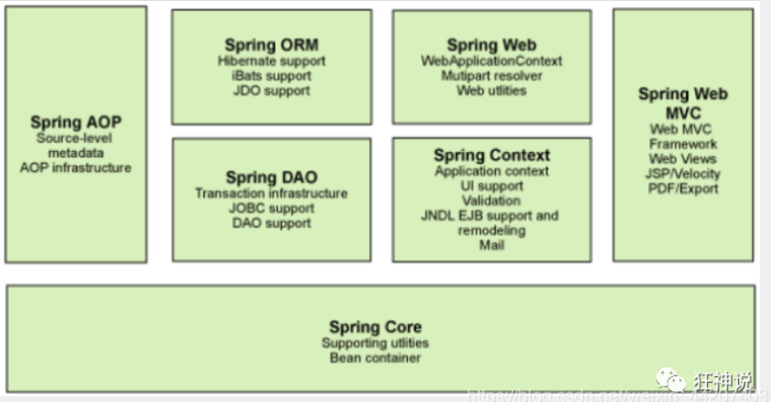

# SpringFramework

## 前情导入

我们先用我们原来的方式写一段代码 .

1、先写一个UserDao接口

```java
public interface UserDao {
   public void getUser();
}
```

2、再去写Dao的实现类

```java
public class UserDaoImpl implements UserDao {
   @Override
   public void getUser() {
       System.out.println("获取用户数据");
  }
}
```

3、然后去写UserService的接口

```
public interface UserService {
   public void getUser();
}
123
```

4、最后写Service的实现类

```java
public class UserServiceImpl implements UserService {
   private UserDao userDao = new UserDaoImpl();

   @Override
   public void getUser() {
       userDao.getUser();
  }
}
```

5、测试一下

```java
@Test
public void test(){
   UserService service = new UserServiceImpl();
   service.getUser();
}
```

这是我们原来的方式 , 开始大家也都是这么去写的对吧 . 那我们现在修改一下 .

把Userdao的实现类增加一个 .

```java
public class UserDaoMySqlImpl implements UserDao {
   @Override
   public void getUser() {
       System.out.println("MySql获取用户数据");
  }
}
```

紧接着我们要去使用MySql的话 , 我们就需要去service实现类里面修改对应的实现

```java
public class UserServiceImpl implements UserService {
   private UserDao userDao = new UserDaoMySqlImpl();

   @Override
   public void getUser() {
       userDao.getUser();
  }
}
```

在假设, 我们再增加一个Userdao的实现类 .

```java
public class UserDaoOracleImpl implements UserDao {
   @Override
   public void getUser() {
       System.out.println("Oracle获取用户数据");
  }
}
```

那么我们要使用Oracle , 又需要去service实现类里面修改对应的实现 . 假设我们的这种需求非常大 , 这种方式就根本不适用了, 甚至反人类对吧 , 每次变动 , 都需要修改大量代码 . 这种设计的耦合性太高了, 牵一发而动全身 .

**那我们如何去解决呢 ?**

我们可以在需要用到他的地方 , 不去实现它 , 而是留出一个接口 , 利用set , 我们去代码里修改下 .

```java
public class UserServiceImpl implements UserService {
   private UserDao userDao;
// 利用set实现
   public void setUserDao(UserDao userDao) {
       this.userDao = userDao;
  }

   @Override
   public void getUser() {
       userDao.getUser();
  }
}
```

现在去我们的测试类里 , 进行测试 ;

```java
@Test
public void test(){
   UserServiceImpl service = new UserServiceImpl();
   service.setUserDao( new UserDaoMySqlImpl() );
   service.getUser();
   //那我们现在又想用Oracle去实现呢
   service.setUserDao( new UserDaoOracleImpl() );
   service.getUser();
}
```

仔细去思考一下 , 以前所有东西都是由程序去进行控制创建 , 而现在是由我们自行控制创建对象 , 把主动权交给了调用者 . 程序不用去管怎么创建,怎么实现了 . 它只负责提供一个接口 .

这种思想 , 从本质上解决了问题 , 我们程序员不再去管理对象的创建了 , 更多的去关注业务的实现 . 耦合性大大降低 . 这也就是IOC的原型 !

## 一、SpringFramework介绍

### 1.1 Spring 和 SpringFramework概念

[spring官网](https://spring.io/projects)

广义的 Spring：Spring 技术栈（全家桶)

广义上的 Spring 泛指以 Spring Framework 为基础的 Spring 技术栈。

经过十多年的发展，Spring 已经不再是一个单纯的应用框架，而是逐渐发展成为一个由多个不同子项目（模块）组成的成熟技术，例如 Spring Framework、Spring MVC、SpringBoot、Spring Cloud、Spring Data、Spring Security 等，其中 Spring Framework 是其他子项目的基础。

这些子项目涵盖了从企业级应用开发到云计算等各方面的内容，能够帮助开发人员解决软件发展过程中不断产生的各种实际问题，给开发人员带来了更好的开发体验。

狭义的 Spring：Spring Framework（基础框架）

狭义的 Spring 特指 Spring Framework，通常我们将它称为 Spring 框架。

Spring Framework（Spring框架）是一个开源的应用程序框架，由SpringSource公司开发，最初是为了解决企业级开发中各种常见问题而创建的。它提供了很多功能，例如：依赖注入（Dependency Injection）、面向切面编程（AOP）、声明式事务管理（TX）等。其主要目标是使企业级应用程序的开发变得更加简单和快速，并且Spring框架被广泛应用于Java企业开发领域。

Spring全家桶的其他框架都是以SpringFramework框架为基础！

对比理解：

QQ 和 腾讯

腾讯 = Spring

QQ = SpringFramework

### 1.2 SpringFramework主要功能模块


| 功能模块       | 功能介绍                                                    |
| -------------- | ----------------------------------------------------------- |
| Core Container | 核心容器，在 Spring 环境下使用任何功能都必须基于 IOC 容器。 |
| AOP&Aspects    | 面向切面编程                                                |
| TX             | 声明式事务管理。                                            |
| Spring MVC     | 提供了面向Web应用程序的集成功能。                           |

Spring 框架是一个分层架构，由 7 个定义良好的模块组成。Spring 模块构建在核心容器之上，核心容器定义了创建、配置和管理 bean 的方式 



组成 Spring 框架的每个模块（或组件）都可以单独存在，或者与其他一个或多个模块联合实现。每个模块的功能如下：

- **核心容器**：核心容器提供 Spring 框架的基本功能。核心容器的主要组件是 BeanFactory，它是工厂模式的实现。BeanFactory 使用*控制反转*（IOC） 模式将应用程序的配置和依赖性规范与实际的应用程序代码分开。
- **Spring 上下文**：Spring 上下文是一个配置文件，向 Spring 框架提供上下文信息。Spring 上下文包括企业服务，例如 JNDI、EJB、电子邮件、国际化、校验和调度功能。
- **Spring AOP**：通过配置管理特性，Spring AOP 模块直接将面向切面的编程功能 , 集成到了 Spring 框架中。所以，可以很容易地使 Spring 框架管理任何支持 AOP的对象。Spring AOP 模块为基于 Spring 的应用程序中的对象提供了事务管理服务。通过使用 Spring AOP，不用依赖组件，就可以将声明性事务管理集成到应用程序中。
- **Spring DAO**：JDBC DAO 抽象层提供了有意义的异常层次结构，可用该结构来管理异常处理和不同数据库供应商抛出的错误消息。异常层次结构简化了错误处理，并且极大地降低了需要编写的异常代码数量（例如打开和关闭连接）。Spring DAO 的面向 JDBC 的异常遵从通用的 DAO 异常层次结构。
- **Spring ORM**：Spring 框架插入了若干个 ORM 框架，从而提供了 ORM 的对象关系工具，其中包括 JDO、Hibernate 和 iBatis SQL Map。所有这些都遵从 Spring 的通用事务和 DAO 异常层次结构。
- **Spring Web 模块**：Web 上下文模块建立在应用程序上下文模块之上，为基于 Web 的应用程序提供了上下文。所以，Spring 框架支持与 Jakarta Struts 的集成。Web 模块还简化了处理多部分请求以及将请求参数绑定到域对象的工作。
- **Spring MVC 框架**：MVC 框架是一个全功能的构建 Web 应用程序的 MVC 实现。通过策略接口，MVC 框架变成为高度可配置的，MVC 容纳了大量视图技术，其中包括 JSP、Velocity、Tiles、iText 和 POI。

## 二、Spring IoC容器和核心概念

### 2.1 组件和组件管理概念

#### 2.1.1什么是组件?

在Spring框架中，"组件"（Component）是指在应用程序中可重用的模块化部分。组件通常用于执行特定的功能，可以通过配置和注解来定义。在Spring中，有几种类型的组件，其中最常见的是Spring Bean。

1. **Spring Bean（Spring Bean）**：Spring中的Bean是应用程序中的组件，由Spring容器管理。Bean是由Spring IoC容器实例化、装配和管理的对象。可以使用注解（如`@Component`、`@Service`、`@Repository`等）或XML配置来定义Spring Bean。Spring Bean可以是任何类，从简单的POJO（普通的Java对象）到复杂的业务逻辑对象。
2. **Aspect（切面）**：切面是用于跨多个类的横切关注点的模块化组件。它们通常用于实现横切关注点，例如日志记录、事务管理等。
3. **Configuration（配置类）**：配置类是用Java代码或XML配置定义Spring应用程序的配置元数据的类。配置类中通常包含Bean的定义、依赖注入的设置以及其他配置选项。
4. **Service（服务）**：服务是用于处理业务逻辑的组件。在Spring中，服务通常使用`@Service`注解进行标记，以便Spring容器可以识别并进行适当的管理。
5. **Repository（存储库）**：存储库是用于数据访问的组件。在Spring中，存储库通常使用`@Repository`注解进行标记，它们负责与数据源（例如数据库）进行交互。
6. **Controller（控制器）**：控制器是处理用户请求并返回响应的组件。在Spring MVC中，控制器通常使用`@Controller`注解进行标记。

**整个项目就是由各种组件搭建而成的**：


#### 2.1.2 Spring充当组件管理角色（IoC）

==组件==可以完全交给Spring 框架进行管理，Spring框架替代了程序员原有的new对象和对象属性赋值动作等！

Spring具体的组件管理动作包含：

组件对象实例化

组件属性属性赋值

组件对象之间引用

组件对象存活周期管理

......

我们只需要编写元数据（配置文件）告知Spring 管理哪些类组件和他们的关系即可！

>注意：组件是映射到应用程序中所有可重用组件的Java对象，应该是可复用的功能对象！
>
>组件一定是对象
>
>对象不一定是组件

综上所述，Spring 充当一个组件容器，创建、管理、存储组件，减少了我们的编码压力，让我们更加专注进行业务编写！

### 2.2 Spring IoC容器和容器实现

#### 2.2.1 SpringIoC容器介绍

Spring IoC 容器，负责实例化、配置和组装 bean（组件）。容器通过读取配置元数据来获取有关要实例化、配置和组装组件的指令。配置元数据以==XML、Java 注解或 Java 代码形式表现== 。它允许表达组成应用程序的组件以及这些组件之间丰富的相互依赖关系。

#### 2.2.2 SpringIoC容器具体接口和实现类

**SpringIoc容器接口： **

`BeanFactory `接口提供了一种高级配置机制，能够管理任何类型的对象，它是SpringIoC容器标准化超接口！

`ApplicationContext` 是 `BeanFactory` 的子接口

**ApplicationContext容器实现类：**

| 类型名                             | 简介                                                         |
| ---------------------------------- | ------------------------------------------------------------ |
| ClassPathXmlApplicationContext     | 通过读取类路径下的 XML 格式的配置文件创建 IOC 容器对象       |
| FileSystemXmlApplicationContext    | 通过文件系统路径读取 XML 格式的配置文件创建 IOC 容器对象     |
| AnnotationConfigApplicationContext | 通过读取Java配置类创建 IOC 容器对象                          |
| WebApplicationContext              | 专门为 Web 应用准备，基于 Web 环境创建 IOC 容器对象，并将对象引入存入 ServletContext 域中。 |

#### 2.2.3 SpringIoC容器管理配置方式

Spring IoC 容器使用多种形式的配置元数据。此配置元数据表示您作为应用程序开发人员如何告诉 Spring 容器实例化、配置和组装应用程序中的对象。


Spring框架提供了多种配置方式：==XML配置方式、注解方式和Java配置类方式==

1.XML配置方式：是Spring框架最早的配置方式之一，通过在XML文件中定义Bean及其依赖关系、Bean的作用域等信息，让Spring IoC容器来管理Bean之间的依赖关系。该方式从Spring框架的第一版开始提供支持。

2.注解方式：从Spring 2.5版本开始提供支持，可以通过在Bean类上使用注解来代替XML配置文件中的配置信息。通过在Bean类上加上相应的注解（如@Component, @Service, @Autowired等），将Bean注册到Spring IoC容器中，这样Spring IoC容器就可以管理这些Bean之间的依赖关系。

3.Java配置类方式：从Spring 3.0版本开始提供支持，通过Java类来定义Bean、Bean之间的依赖关系和配置信息，从而代替XML配置文件的方式。Java配置类是一种使用Java编写配置信息的方式，通过@Configuration、@Bean等注解来实现Bean和依赖关系的配置。

### 2.3 Spring IoC / DI概念总结

#### IoC容器

Spring IoC 容器，负责实例化、配置和组装 bean（组件）核心容器。容器通过读取配置元数据来获取有关要实例化、配置和组装组件的指令。

#### IoC（Inversion of Control）控制反转

IoC 主要是针对对象的创建和调用控制而言的，也就是说，当应用程序需要使用一个对象时，不再是应用程序直接创建该对象，而是由 IoC 容器来创建和管理，即控制权由应用程序转移到 IoC 容器中，也就是“反转”了控制权。这种方式基本上是通过依赖查找的方式来实现的，即 IoC 容器维护着构成应用程序的对象，并负责创建这些对象。

#### DI (Dependency Injection) 依赖注入

DI 是指在组件之间传递依赖关系的过程中，将依赖关系在容器内部进行处理，这样就不必在应用程序代码中硬编码对象之间的依赖关系，实现了对象之间的解耦合。在 Spring 中，DI 是通过 XML 配置文件或注解的方式实现的。它提供了三种形式的依赖注入：构造函数注入、Setter 方法注入和接口注入。

## 三、Spring IoC实践和应用

###  3.1 Spring IoC / DI 实现步骤

1.**配置元数据（配置）**

配置元数据，既是编写交给SpringIoC容器管理组件的信息，配置方式有三种。

基于 XML 的配置元数据的基本结构：

<bean id="..." [1] class="..." [2]>      

​	<!-- collaborators and configuration for this bean go here -->  

< /bean>

```xml
<?xml version="1.0" encoding="UTF-8"?>
<!-- 此处要添加一些约束，配置文件的标签并不是随意命名 -->
<beans xmlns="http://www.springframework.org/schema/beans"
  xmlns:xsi="http://www.w3.org/2001/XMLSchema-instance"
  xsi:schemaLocation="http://www.springframework.org/schema/beans
    https://www.springframework.org/schema/beans/spring-beans.xsd">

  <bean id="..." [1] class="..." [2]>  
    <!-- collaborators and configuration for this bean go here -->
  </bean>

  <bean id="..." class="...">
    <!-- collaborators and configuration for this bean go here -->
  </bean>
  <!-- more bean definitions go here -->
</beans>
```

Spring IoC 容器管理一个或多个组件。这些 组件是使用你提供给容器的配置元数据（例如，以 XML < bean/> 定义的形式）创建的。

< bean /> 标签 == 组件信息声明

* `id`属性是标识单个 Bean 定义的字符串

* `class `属性定义 Bean 的类型并使用完全限定的类名。

**2.实例化IoC容器**

提供给`` ApplicationContext `构造函数的位置路径是资源字符串地址，允许容器从各种外部资源（如本地文件系统、Java CLASSPATH 等）加载配置元数据。

我们应该选择一个合适的容器实现类，进行IoC容器的实例化工作：

```java
//实例化ioc容器,读取外部配置文件,最终会在容器内进行ioc和di动作
ApplicationContext context = new ClassPathXmlApplicationContext("services.xml", "daos.xml");
```

3.**获取Bean（组件）**

`ApplicationContext `是一个高级工厂的接口，能够维护不同 bean 及其依赖项的注册表。通过使用方法 `T getBean(String name, Class<T> requiredType) `，您可以检索 bean 的实例。

允许读取 Bean 定义并访问它们，如以下示例所示：

```java
//创建ioc容器对象，指定配置文件，ioc也开始实例组件对象
ApplicationContext context = new ClassPathXmlApplicationContext("services.xml", "daos.xml");
//获取ioc容器的组件对象
PetStoreService service = context.getBean("petStore", PetStoreService.class);
//使用组件对象
List<String> userList = service.getUsernameList();
```

### 3.2 基于XML配置方式组件管理

#### 3.2.1 组件（Bean）信息声明配置（IoC）

**目标：**我们学习，如何通过定义XML配置文件，声明组件类信息，交给 Spring 的 IoC 容器进行组件管理！

**思路：**


**准备项目**

a 创建maven工程（spring-ioc-xml-01）

b 导入SpringIoC相关依赖

pom.xml

```xaml
<dependencies>
    <!--spring context依赖-->
    <!--当你引入Spring Context依赖之后，表示将Spring的基础依赖引入了-->
    <dependency>
        <groupId>org.springframework</groupId>
        <artifactId>spring-context</artifactId>
        <version>5.3.13</version> <!-- 以5.3.13为例 -->
    </dependency>
    <!--junit5测试-->
    <dependency>
        <groupId>org.junit.jupiter</groupId>
        <artifactId>junit-jupiter-api</artifactId>
        <version>5.3.1</version>
    </dependency>
</dependencies>
```

**基于无参数构造函数**

当通过构造函数方法创建一个 bean（组件对象） 时，所有普通类都可以由 Spring 使用并与之兼容。也就是说，正在开发的类不需要实现任何特定的接口或以特定的方式进行编码。只需指定 Bean 类信息就足够了。但是，默认情况下，我们需要一个默认（空）构造函数。

a 准备组件类

```java
package com.atguigu.ioc;

public class HappyComponent {

    //默认包含无参数构造函数

    public void doWork() {
        System.out.println("HappyComponent.doWork");
    }
}
```

b xml配置文件编写

创建携带spring约束的xml配置文件


编写配置文件：

文件：resources/spring-bean-01.xml

```java
<!-- 实验一 [重要]创建bean -->
<bean id="happyComponent" class="com.atguigu.ioc.HappyComponent"/>
```

* bean标签：通过配置bean标签告诉IOC容器需要创建对象的组件信息

* id属性：bean的唯一标识,方便后期获取Bean！

* class属性：组件类的全限定符！

	> 注意：要求当前组件类必须包含无参数构造函数！

**基于静态工厂方法实例化**

除了使用构造函数实例化对象，还有一类是通过工厂模式实例化对象。接下来我们讲解如何定义使用静态工厂方法创建Bean的配置 ！

a 准备组件类

```java
public class ClientService {
  private static ClientService clientService = new ClientService();
  private ClientService() {}

  public static ClientService createInstance() {
  
    return clientService;
  }
}
```

b

xml配置文件编写

文件：resources/spring-bean-01.xml

```java
<bean id="clientService" class="examples.ClientService" factory-method="createInstance"/>
```

* class属性：指定工厂类的全限定符！
* factory-method: 指定静态工厂方法，注意，该方法必须是static方法。

**基于实例工厂方法实例化**

接下来我们讲解下如何定义使用实例工厂方法创建Bean的配置 ！

a准备组建类

```java
public class DefaultServiceLocator {

  private static ClientServiceImplclientService = new ClientServiceImpl();

  public ClientService createClientServiceInstance() {
    return clientService;
  }
}
```

b xml配置文件编写

文件：resources/spring-bean-01.xml

```xml
<!-- 将工厂类进行ioc配置 -->
<bean id="serviceLocator" class="examples.DefaultServiceLocator">
</bean>

<!-- 根据工厂对象的实例工厂方法进行实例化组件对象 -->
<bean id="clientService" factory-bean="serviceLocator" factory-method="createClientServiceInstance"/>
```

* factory-bean属性：指定当前容器中工厂Bean 的名称。
* factory-method:  指定实例工厂方法名。注意，实例方法必须是非static的！

#### 3.2.2 组件（Bean）依赖注入配置（DI）

**目标:**

通过配置文件,实现IoC容器中Bean之间的引用（依赖注入DI配置）。

主要涉及注入场景：基于构造函数的依赖注入和基于 Setter 的依赖注入。


**思路:**


**1.基于构造函数的依赖注入（单个构造参数）**

a 介绍

基于构造函数的 DI 是通过容器调用具有多个参数的构造函数来完成的，每个参数表示一个依赖项。

下面的示例演示一个只能通过构造函数注入进行依赖项注入的类！

b 准备组件类 

```java
public class UserDao {
}
public class UserService {
    private UserDao userDao;
    public UserService(UserDao userDao) {
        this.userDao = userDao;
    }
}
```

c 编写配置文件

文件：resources/spring-02.xml

```xml
<beans>
  <!-- 引用类bean声明 -->
  <bean id="userService" class="x.y.UserService">
   <!-- 构造函数引用 -->
    <constructor-arg ref="userDao"/>
  </bean>
  <!-- 被引用类bean声明 -->
  <bean id="userDao" class="x.y.UserDao"/>
</beans>
```

* constructor-arg标签：可以引用构造参数 ref引用其他bean的标识。

**2.基于构造函数的依赖注入（多构造参数解析）**

a 介绍

基于构造函数的 DI 是通过容器调用具有多个参数的构造函数来完成的，每个参数表示一个依赖项。

下面的示例演示通过构造函数注入多个参数，参数包含其他bean和基本数据类型！

b 准备组件类

```java
public class UserDao {
}
public class UserService {
    
    private UserDao userDao;
    
    private int age;
    
    private String name;

    public UserService(int age , String name ,UserDao userDao) {
        this.userDao = userDao;
        this.age = age;
        this.name = name;
    }
}
```

c 编写配置文件

```xml
<!-- 场景1: 多参数，可以按照相应构造函数的顺序注入数据 -->
<beans>
  <bean id="userService" class="x.y.UserService">
    <!-- value直接注入基本类型值 -->
    <constructor-arg  value="18"/>
    <constructor-arg  value="赵伟风"/>
    
    <constructor-arg  ref="userDao"/>
  </bean>
  <!-- 被引用类bean声明 -->
  <bean id="userDao" class="x.y.UserDao"/>
</beans>


<!-- 场景2: 多参数，可以按照相应构造函数的名称注入数据 -->
<beans>
  <bean id="userService" class="x.y.UserService">
    <!-- value直接注入基本类型值 -->
    <constructor-arg name="name" value="赵伟风"/>
    <constructor-arg name="userDao" ref="userDao"/>
    <constructor-arg name="age"  value="18"/>
  </bean>
  <!-- 被引用类bean声明 -->
  <bean id="userDao" class="x.y.UserDao"/>
</beans>

<!-- 场景2: 多参数，可以按照相应构造函数的角标注入数据 
           index从0开始 构造函数(0,1,2....)
-->
<beans>
    <bean id="userService" class="x.y.UserService">
    <!-- value直接注入基本类型值 -->
    <constructor-arg index="1" value="赵伟风"/>
    <constructor-arg index="2" ref="userDao"/>
    <constructor-arg index="0"  value="18"/>
  </bean>
  <!-- 被引用类bean声明 -->
  <bean id="userDao" class="x.y.UserDao"/>
</beans>

```

* constructor-arg标签：指定构造参数和对应的值
* constructor-arg标签：name属性指定参数名、index属性指定参数角标、value属性指定普通属性值

3.==**基于Setter方法依赖注入**== 

a 介绍

开发中，除了构造函数注入（DI）更多的使用的Setter方法进行注入！

下面的示例演示一个只能使用纯 setter 注入进行依赖项注入的类。

b 准备组件类

```java
public Class MovieFinder{

}
public class SimpleMovieLister {

  private MovieFinder movieFinder;
  
  private String movieName;

  public void setMovieFinder(MovieFinder movieFinder) {
    this.movieFinder = movieFinder;
  }
  
  public void setMovieName(String movieName){
    this.movieName = movieName;
  }
  // business logic that actually uses the injected MovieFinder is omitted...
}
```

c 编写配置文件

```xml
<bean id="simpleMovieLister" class="examples.SimpleMovieLister">
  <!-- setter方法，注入movieFinder对象的标识id
       name = 属性名  ref = 引用bean的id值
   -->
  <property name="movieFinder" ref="movieFinder" />
  <!-- setter方法，注入基本数据类型movieName
       name = 属性名 value= 基本类型值
   -->
  <property name="movieName" value="消失的她"/>
</bean>
<bean id="movieFinder" class="examples.MovieFinder"/>
```

* property标签： 可以给setter方法对应的属性赋值
* property 标签： name属性代表==set方法标识==、ref代表引用bean的标识id、value属性代表基本属性值

总结：

依赖注入（DI）包含引用类型和基本数据类型，同时注入的方式也有多种！主流的注入方式为setter方法注入和构造函数注入，两种注入语法都需要掌握！

> 需要特别注意：引用其他bean，使用ref属性。直接注入基本类型值，使用value属性。

### 3.3 IoC容器创建和使用

上面只是讲解了如何在XML格式的配置文件编写IoC和DI配置！

想要配置文件中声明组件类信息真正的进行实例化成Bean对象和形成Bean之间的引用关系，我们需要声明IoC容器对象，读取配置文件，实例化组件和关系维护的过程都是在IoC容器中实现的！

**容器实例化**

```java
//方式1:实例化并且指定配置文件
//参数：String...locations 传入一个或者多个配置文件
ApplicationContext context = 
           new ClassPathXmlApplicationContext("services.xml", "daos.xml");
           
//方式2:先实例化，再指定配置文件，最后刷新容器触发Bean实例化动作 [springmvc源码和contextLoadListener源码方式]  
ApplicationContext context = 
           new ClassPathXmlApplicationContext();   
//设置配置配置文件,方法参数为可变参数,可以设置一个或者多个配置
iocContainer1.setConfigLocations("services.xml", "daos.xml");
//后配置的文件,需要调用refresh方法,触发刷新配置
iocContainer1.refresh();           

```

**Bean对象读取**

```java
//方式1: 根据id获取
//没有指定类型,返回为Object,需要类型转化!
HappyComponent happyComponent = 
        (HappyComponent) iocContainer.getBean("bean的id标识");
        
//使用组件对象        
happyComponent.doWork();

//方式2: 根据类型获取
//根据类型获取,但是要求,同类型(当前类,或者之类,或者接口的实现类)只能有一个对象交给IoC容器管理
//配置两个或者以上出现: org.springframework.beans.factory.NoUniqueBeanDefinitionException 问题
HappyComponent happyComponent = iocContainer.getBean(HappyComponent.class);
happyComponent.doWork();

//方式3: 根据id和类型获取
HappyComponent happyComponent = iocContainer.getBean("bean的id标识", HappyComponent.class);
happyComponent.doWork();

根据类型来获取bean时，在满足bean唯一性的前提下，其实只是看：『对象 instanceof 指定的类型』的返回结果，
只要返回的是true就可以认定为和类型匹配，能够获取到。
```

### 3.4 声明 注入 创建 小案例

> 导入Jar包

```xml
   <!--spring context依赖-->
    <!--当你引入Spring Context依赖之后，表示将Spring的基础依赖引入了-->
    <dependency>
        <groupId>org.springframework</groupId>
        <artifactId>spring-context</artifactId>
        <version>6.0.6</version>
    </dependency>
```

Address.java

```java
 public class Address {
 
     private String address;
 
     public String getAddress() {
         return address;
    }
 
     public void setAddress(String address) {
         this.address = address;
    }
 }
```

Student.java

```java
 import java.util.List;
 import java.util.Map;
 import java.util.Properties;
 import java.util.Set;
 
 public class Student {
 
     private String name;
     private Address address;
     private String[] books;
     private List<String> hobbys;
     private Map<String,String> card;
     private Set<String> games;
     private String wife;
     private Properties info;
 
     public void setName(String name) {
         this.name = name;
    }
 
     public void setAddress(Address address) {
         this.address = address;
    }
 
     public void setBooks(String[] books) {
         this.books = books;
    }
 
     public void setHobbys(List<String> hobbys) {
         this.hobbys = hobbys;
    }
 
     public void setCard(Map<String, String> card) {
         this.card = card;
    }
 
     public void setGames(Set<String> games) {
         this.games = games;
    }
 
     public void setWife(String wife) {
         this.wife = wife;
    }
 
     public void setInfo(Properties info) {
         this.info = info;
    }
 
     public void show(){
         System.out.println("name="+ name
                 + ",address="+ address.getAddress()
                 + ",books="
        );
         for (String book:books){
             System.out.print("<<"+book+">>\t");
        }
         System.out.println("\n爱好:"+hobbys);
 
         System.out.println("card:"+card);
 
         System.out.println("games:"+games);
 
         System.out.println("wife:"+wife);
 
         System.out.println("info:"+info);
 
    }
 }
```

#### 扩展的注入

1、**常量注入**

```java
 <bean id="student" class="com.kuang.pojo.Student">
     <property name="name" value="小明"/>
 </bean>
```

测试：

```java
 @Test
 public void test01(){
     ApplicationContext context = new ClassPathXmlApplicationContext("applicationContext.xml");
 
     Student student = (Student) context.getBean("student");
 
     System.out.println(student.getName());
 
 }
```

2、**Bean注入**

注意点：这里的值是一个引用，ref

```java
 <bean id="addr" class="com.kuang.pojo.Address">
     <property name="address" value="重庆"/>
 </bean>
 
 <bean id="student" class="com.kuang.pojo.Student">
     <property name="name" value="小明"/>
     <property name="address" ref="addr"/>
 </bean>
```

3、**数组注入**

```java
 <bean id="student" class="com.kuang.pojo.Student">
     <property name="name" value="小明"/>
     <property name="address" ref="addr"/>
     <property name="books">
         <array>
             <value>西游记</value>
             <value>红楼梦</value>
             <value>水浒传</value>
         </array>
     </property>
 </bean>
```

4、**List注入**

```java
 <property name="hobbys">
     <list>
         <value>听歌</value>
         <value>看电影</value>
         <value>爬山</value>
     </list>
 </property>
```

5、**Map注入**

```java
 <property name="card">
     <map>
         <entry key="中国邮政" value="456456456465456"/>
         <entry key="建设" value="1456682255511"/>
     </map>
 </property>
```

6、**set注入**

```java
 <property name="games">
     <set>
         <value>LOL</value>
         <value>BOB</value>
         <value>COC</value>
     </set>
 </property>
```

7、**Null注入**

```java
 <property name="wife"><null/></property>
```

8、**Properties注入**

```java
 <property name="info">
     <props>
         <prop key="学号">20190604</prop>
         <prop key="性别">男</prop>
         <prop key="姓名">小明</prop>
     </props>
 </property>
```

> p命名和c命名注入

User.java ：【注意：这里没有有参构造器！】

```java
 public class User {
     private String name;
     private int age;
 
     public void setName(String name) {
         this.name = name;
    }
 
     public void setAge(int age) {
         this.age = age;
    }
 
     @Override
     public String toString() {
         return "User{" +
                 "name='" + name + '\'' +
                 ", age=" + age +
                 '}';
    }
 }
```

1、P命名空间注入 : 需要在头文件中加入约束文件

```java
 导入约束 : xmlns:p="http://www.springframework.org/schema/p"
 
 <!--P(属性: properties)命名空间 , 直接注入属性-->
 <bean id="user" class="com.kuang.pojo.User" p:name="狂神" p:age="18"/>
```

2、c 命名空间注入 : 需要在头文件中加入约束文件

```java
 导入约束 : xmlns:c="http://www.springframework.org/schema/c"
 <!--C(构造: Constructor)命名空间 , 使用构造器注入-->
 <bean id="user" class="com.kuang.pojo.User" c:name="狂神" c:age="18"/>
```

发现问题：爆红了，刚才我们没有写有参构造！

解决：把有参构造器加上，这里也能知道，c 就是所谓的构造器注入！

测试代码：

```java
 @Test
 public void test02(){
     ApplicationContext context = new ClassPathXmlApplicationContext("applicationContext.xml");
     User user = (User) context.getBean("user");
     System.out.println(user);
 }
```
